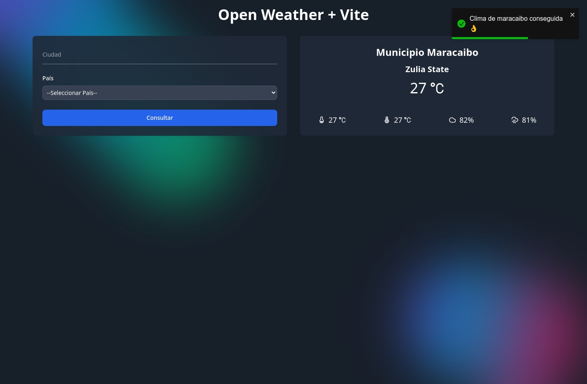

## Purpose

Show the weather of several countries using the Open Weather Api, the countries are as follows:

- Argentina
- Alemania
- Estados Unidos
- Ecuador
- Chile
- Colombia
- Perú
- Venezuela

### Begin

```bash
npm i

# or

pnpm i

# or

bun i
```

### Environment Variables

```env
VITE_API_KEY = "xxx"
```

**Note**: The api is from open weather

### Run application

```bash
npm run dev

# or

pnpm run dev

# or

bun dev
```
